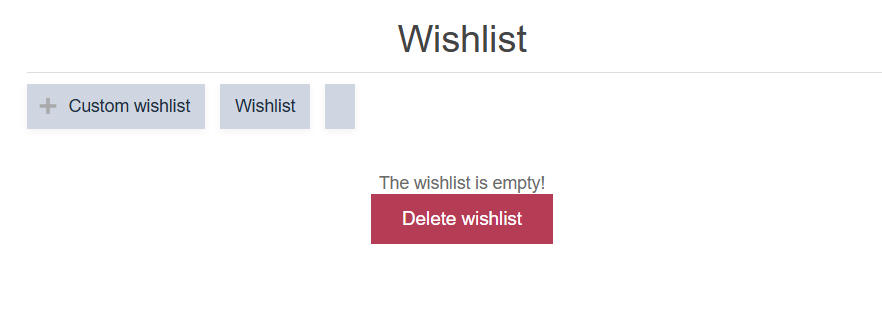

# nopCommerce QA Pet Project

## 📌 About the Project

This is a manual QA pet project created to practice software testing on the nopCommerce Demo Store.

The goal of the project was to test the main functionality of an e-commerce web application, create test documentation in Jira, perform positive and negative testing, and identify real defects.

---

## 🧪 Testing Scope

The following functionality was tested:

- User login and authentication
- Password recovery
- Product search
- Shopping cart
- Wishlist
- Checkout
- Payment form validation
- Product reviews
- Product comparison
- User account functionality
- Address form validation
- Email a friend
- Contact Us form
- Newsletter subscription
- Recently viewed products

---

## 🔍 Testing Techniques

During testing, I used:

- Functional testing
- Positive testing
- Negative testing
- Boundary value testing
- Input validation testing
- Exploratory testing

---

## 🛠 Tools

- Jira — test case and bug tracking
- Google Chrome — testing environment
- Chrome DevTools — web application inspection
- GitHub — project documentation

---

## 📋 Test Documentation

The project contains 29 Jira issues covering different areas of the application.

Test cases were created with:

- Preconditions
- Test data
- Steps to reproduce
- Expected result
- Actual result
- Test status

The test cases cover both positive and negative scenarios.

---

## 🐞 Bug Found

### BUG-WISHLIST-001 — Wishlist with a whitespace-only name can be created

**Steps to reproduce:**

1. Open the Wishlist page.
2. Click `Custom wishlist`.
3. Enter only spaces into the wishlist name field.
4. Click `OK`.

**Expected result:**

A whitespace-only wishlist name should be treated as empty. The wishlist should not be created and a validation message should be displayed.

**Actual result:**

The application creates a new wishlist with a whitespace-only name. The wishlist is displayed as a blank tab.

### Screenshot

**Reproducibility:** 2/2 (100%)

**Priority:** Medium

---

## ✅ Project Result

The main functionality of the nopCommerce Demo Store was manually tested across multiple modules.

The project demonstrates practical experience in:

- Creating and executing test cases
- Testing web application functionality
- Positive and negative testing
- Testing input validation
- Performing exploratory testing
- Identifying and reproducing defects
- Creating bug reports in Jira
- Maintaining QA documentation
